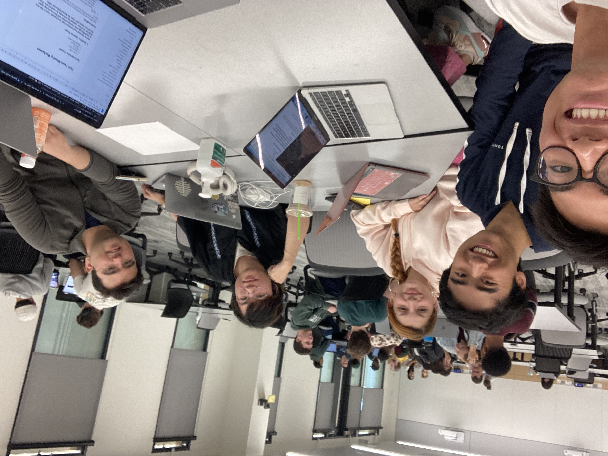

# Opportune

[Website Link](https://www.opportune.cc/)  
[Original Design Document](https://docs.google.com/document/d/1SeWRSx2n52ijeMqIQWEI0jRcOt1dePZC6fZ5yYvKcaA/edit#heading=h.tmu8pj8tb51n)

## About
 

A platform to tune an internship opportunity to the fullest. After interns receive an offer at a company, we help them get to know the teams and match them to the team of best fit.
After the matching, we hope to provide a dedicated hub for the intern so that they can monitor their project / day-to-day tasks effortlessly.

## Architecture
Frontend: HTML/CSS/Javascript, React, Remix Run, Axios
Backend: Express, MongoDB, Node

**Frontend**

Landing
* `/` landing page
* `/login` login page

New Hire Portal
* `newhire/signup` new hire sign-up
* `newhire/profile` basic information survey for new hire
* `newhire/teams` information about each team new hire may be matched on
* `newhire/survey` matching survey
* `newhire/results` results of matching survey
* `newhire/project` project management tool

Teams Portal
* `teams/signup` team sign-up
* `teams/profile` basic information of the team
* `teams/skills` quick survey to confirm skills required for the team
* `teams/survey` survey to define what the team is looking for (skills, work arrangement, independence, etc.)
* `teams/project` project management tool
* `teams/settings` settings page

Company Portal
* `company/signup` company sign-up
* `company/profile` basic information of the company
* `company/matching` for running company-wide matching survey
* `company/settings` settings page

## Setup Local Development
Frontend Development
- Clone this repository
- Install project dependencies with `npm install`
- Start the development server with `npm run dev`
- Navigate to http://localhost:3000 to view the application.

## Setup Testing Environment
Make sure that Docker is installed prior to running the testing environment.

Frontend
- Run `docker-compose build`
- Run `docker-compose up`

Backend
- Run `docker-compose build`
- Run `docker-compose up`

Matching Engine
- Run `docker-compose build`
- Run `docker-compose up`

*Note:* Each time you make a change to the frontend, you must rerun `docker-compose build` and `docker-compose up`

## Deployment
[opportune.cc](https://www.opportune.cc/)

We are using [render](https://render.com/) to host and run our application. It is deployed as a web service run inside a docker container.
Use this [webhook](https://api.render.com/deploy/srv-cl78shf6e7vc739qgb7g?key=s2AUu7liU0E) to manually redeploy the frontend.

## Authors
Ethan Chen, Eren Aldemir, Stephen Wang, Karina Montiel, Ryan Luu

## Acknowledgments
- [Remix Docs](https://remix.run/docs)
